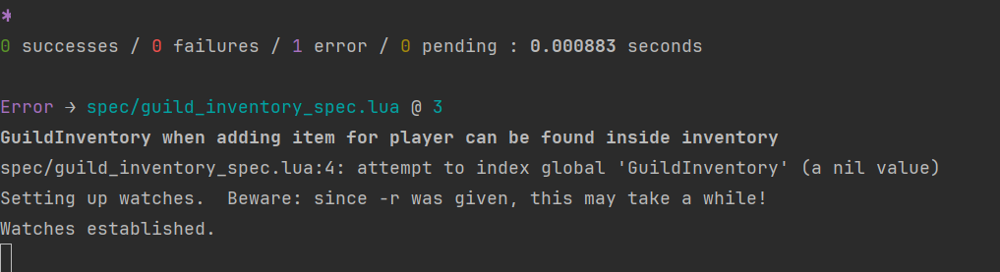

## First Test: Adding Items to Guild Inventory
1. [Failing Test Commit](https://github.com/donedgardo/GuildInventoryWowAddon/commit/306d232b74a1f185e166fe311848ec55751d0b1e)

2. Write enough to make it pass [commit](https://github.com/donedgardo/GuildInventoryWowAddon/commit/3dec175f4b0aa04ccca6cf5bebf6ed0ccac9de68)
3. Refactor [commit](https://github.com/donedgardo/GuildInventoryWowAddon/commit/e7ce1783dc2ba40959a24d234013ea66378eead9)
4. Fail the test by adding the addItem non-existent method[commit](https://github.com/donedgardo/GuildInventoryWowAddon/commit/f0cd4e5b5d4f6da1c2a8091da9f9ec1b155ad960);

5. Make the test pass by adding the method. [commit](https://github.com/donedgardo/GuildInventoryWowAddon/commit/c12268fd841cf7db1bdd7b725cee97e802c132b9)
6. Refactor? Well it may be premature but I think the signature for addItems should require who is adding the item. 
We can leave this for the next test lets finish up. Ill add this to the list.
7. Failing test on error getItems not found. [commit](https://github.com/donedgardo/GuildInventoryWowAddon/commit/8c1d6104a0829faa82b75091d58361d1a25f532e);

8. Make test pass by adding method [commit](70d165ccbb95e39b5d53531f37d55519559cda99)
9. Nothing to refactor imo. Lets go to red by making it fail by asserting there is a new item in the inventory.[commit](95b2b8b731f3ca8dd9111e7c76b6fecf272b37f1)

10. Let's make it pass fastest way possible. [commit](f520e4877b377824160cd84f632e7cf0df10b702)
11. Refactor: Yes we are cheating here but we are letting the test drive the design of  our code and this is important.
Lets rename this test to actually describe what its doing. [commit](218c0e560162bfc6609119e17afe37aa7f1ca1cc)
12. Red: Lets add a new failing test. Lets test the id of the item is the same as the one added.[commit](e4a6f2ece0f82e393fce4dff446d2fc42a1c33f3)
13. Green: Lets make it pass by fastest way possible. Hardcoding it: [commit](b62c143a750053a2d0b5d93263748afd8bde58be)
14. Fix 2: Noticed we had a failing test lets fix it [commit](d013707cca18d443663805d146c1ef01b2c8a9db)
15. Refactor: Well there is some duplication in the test. Lets refactor [commit](0a5ec4d937445a8c8fca10c4d4cd9d72c74cb9f0)
16. Red: So its easy to see that with hardcoded values we can add a new test adding a differnt item to make us stop
cheating and actually implement the solution. Why do we do this, sometime we notice some patterns that allow us to write
the smallest amount of production code to pass the test. Anyways here is the failing test [commit](e45e2aa863652e0c1b74afc56947e0ea02b472dd)
17. Green: Lets write enough production code to make the test pass. [commit](f04729583b0d6a059dd7c5a0e3d4ab4cba928be4)
We ended up having to fix some previous test as the signature now actually was using self so swtiching from '.' to ':'
to be able to access self.items.
18. Refactor: I don't quite see an oportunity to refactor just yet, although I have a feeling the way we are exposing the
items in the getItems method we are a bit tied to the implementation, in other words, if we change the data structure of 
items we will need to change a lot of other parts of the code. I will keep this in mind and add it to the list. Lets go 
and make sure items have an character owner.
19. Red: Add a test adding an item to a character and being able to get their items. [commit]()

